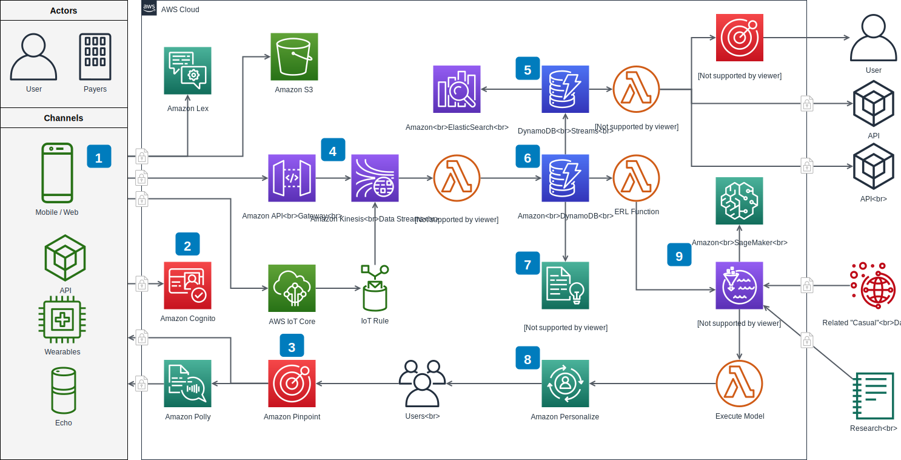

# diagrams.net package for YunoHost; formerly draw.io

[](https://dash.yunohost.org/appci/app/diagramsnet)  
[](https://install-app.yunohost.org/?app=diagramsnet)

> *This package allow you to install diagrams.net quickly and simply on a YunoHost server.  
If you don't have YunoHost, please see [here](https://yunohost.org/#/install) to know how to install and enjoy it.*

## Overview

diagrams.net lets you create a wide range of diagrams, from simple tree and flow diagrams, to highly technical network, rack and electrical diagrams.

**Shipped version:** 12.9.3

## Screenshots



## Demo

* [Official demo](https://app.diagrams.net/)

## Documentation

* Official documentation: <https://www.diagrams.net/doc>

## YunoHost specific features

* Disable third party website integration with Dropbox, Google, Trello, etc

### Supported architectures

* x86-64b - [](https://ci-apps.yunohost.org/ci/apps/diagramsnet/)
* ARMv8-A - [](https://ci-apps-arm.yunohost.org/ci/apps/diagramsnet/)

## Limitations

* Any known limitations.

## Additional information

* Other information you would add about this application

**More information on the documentation page:**  
https://yunohost.org/packaging_apps

## Links

* Report a bug: <https://github.com/YunoHost-Apps/diagramsnet_ynh/issues>
* App website: <https://drawio-app.com>
* Upstream app repository: <https://github.com/jgraph/drawio>
* YunoHost website: <https://yunohost.org>

---

## Developers info

**Only if you want to use a testing branch for coding, instead of merging directly into master.**
Please do your pull request to the [testing branch](https://github.com/YunoHost-Apps/diagramsnet_ynh/tree/testing).

To try the testing branch, please proceed like that.

```bash
sudo yunohost app install https://github.com/YunoHost-Apps/diagramsnet_ynh/tree/testing --debug
or
sudo yunohost app upgrade diagramsnet -u https://github.com/YunoHost-Apps/diagramsnet_ynh/tree/testing --debug
```
