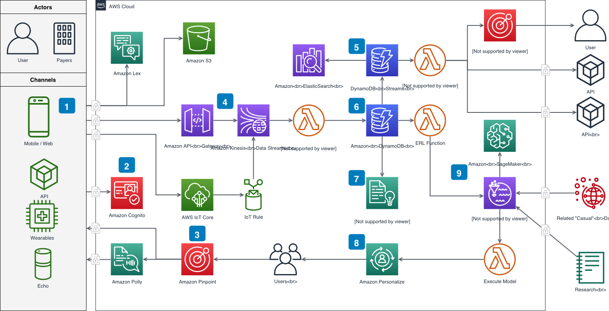

<!--
N.B.: This README was automatically generated by https://github.com/YunoHost/apps/tree/master/tools/README-generator
It shall NOT be edited by hand.
-->

# Diagrams.net pour YunoHost

[](https://dash.yunohost.org/appci/app/diagramsnet)    
[](https://install-app.yunohost.org/?app=diagramsnet)

*[Read this readme in english.](./README.md)*

> *Ce package vous permet d'installer Diagrams.net rapidement et simplement sur un serveur YunoHost.
Si vous n'avez pas YunoHost, regardez [ici](https://yunohost.org/#/install) pour savoir comment l'installer et en profiter.*

## Vue d'ensemble

Application en ligne qui permet de faire des schémas et du dessin vectoriel

**Version incluse :** 20.3.7~ynh1


**Démo :** https://app.diagrams.net/

## Captures d'écran



## Avertissements / informations importantes

## YunoHost specific features

* Integration of third-party websites (Dropbox, Google, Trello, etc.) is disabled.

## Documentations et ressources

* Site officiel de l'app : <https://www.diagrams.net/>
* Documentation officielle de l'admin : <https://www.diagrams.net/doc>
* Dépôt de code officiel de l'app : <https://github.com/jgraph/drawio>
* Documentation YunoHost pour cette app : <https://yunohost.org/app_diagramsnet>
* Signaler un bug : <https://github.com/YunoHost-Apps/diagramsnet_ynh/issues>

## Informations pour les développeurs

Merci de faire vos pull request sur la [branche testing](https://github.com/YunoHost-Apps/diagramsnet_ynh/tree/testing).

Pour essayer la branche testing, procédez comme suit.

``` bash
sudo yunohost app install https://github.com/YunoHost-Apps/diagramsnet_ynh/tree/testing --debug
ou
sudo yunohost app upgrade diagramsnet -u https://github.com/YunoHost-Apps/diagramsnet_ynh/tree/testing --debug
```

**Plus d'infos sur le packaging d'applications :** <https://yunohost.org/packaging_apps>
